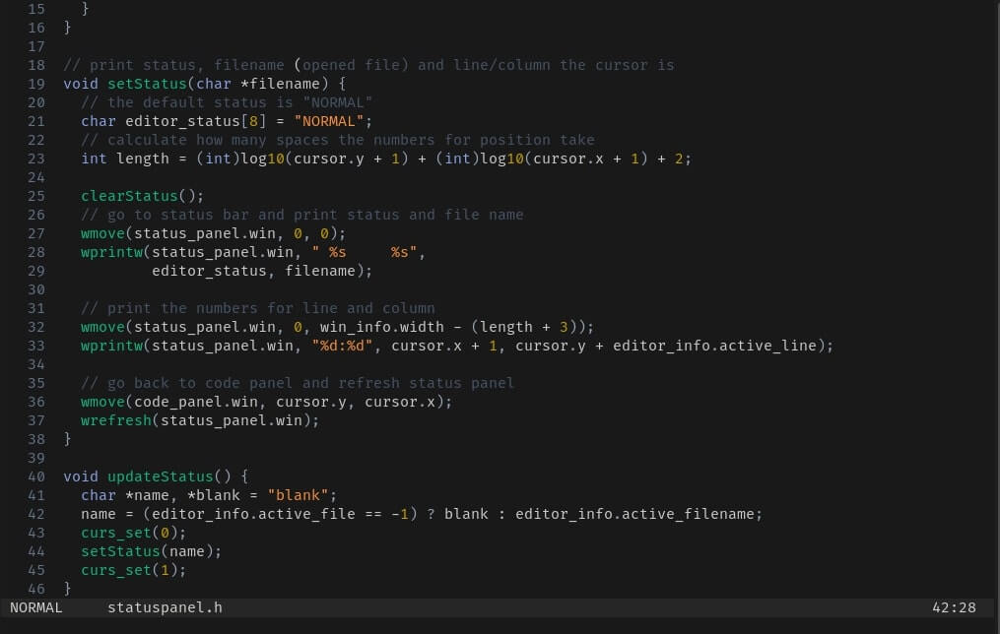

<h1 align="center">Cometa Editor</h1>

<p align="center">A simple and cool text editor.</p>



## Cometa Editor
Cometa is a simple text editor that works inside your terminal.
It is heavily inspired by Vim and Helix, extending their keybinds and a similar look.
For now, it can only open files and view their content, also a very basic (but cool)
code highlighting is enabled in order to help reading code.
Additionaly, only "normal" mode is currently avaiable and you can only navigate through file content.

## Installation
Clone this repository and then, on the project folder, run the _make_ command on your terminal to build:
```
  make
```
It will produce an executable called _cometa_ inside that folder.
__Note__: the app is still on its early stage, you can only view text files and navigate through them.

## Usage
You can it like any other terminal-based text editor:
```shell
  ./editor file.txt
  ./editor
```

## Keymap

### Movement

| Key                           | Description      |
| ----------------------------- | ---------------- |
| <kbd>h</kbd>, <kbd>Left</kbd> |  Move left       |
| <kbd>j</kbd>, <kbd>Down</kbd> |  Move down       |
| <kbd>k</kbd>, <kbd>Up</kbd>   |  Move up         |
| <kbd>l</kbd>, <kbd>Right</kbd>|  Move right      |
| <kbd>Home</kbd>               |  Move to the start of the line       |
| <kbd>End</kbd>                |  Move to the end of the line         |
| <kbd>PageUp</kbd>             |  Move page up                        |
| <kbd>PageDown</kbd>           |  Move page down                      |

### Goto mode

Accessed by typing <kbd>g</kbd> in __normal mode__.

| Key                           | Description      |
| ----------------------------- | ---------------- |
| <kbd>h</kbd>, <kbd>Left</kbd> |  Go to the start of the line         |
| <kbd>j</kbd>, <kbd>Down</kbd> |  Go to the bottom of the screen      |
| <kbd>k</kbd>, <kbd>Up</kbd>   |  Go to the top of the screen         |
| <kbd>l</kbd>, <kbd>Right</kbd>|  Go to the end of the line           |
| <kbd>g</kbd>                  |  Go to the start of the file         |
| <kbd>e</kbd>                  |  Go to the end of the file           |

## License
